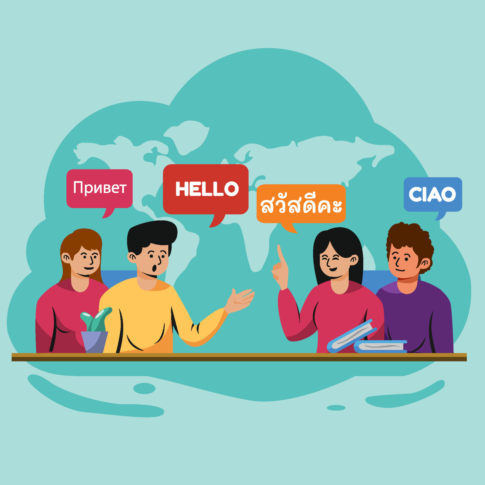

# Pitch

Conversing with others is an essential component to life. It's how we are able to go about our day to day lives. The world is grand, and the diverse cultures that nurture earth are rich. It's just been within recent years in which people have been able to communicate with others globally. This is in part thanks to technology and the rise of translation apps; however, most translation apps fail to provide "in-context" translations to their users. This is why we introduce to you, "Translator." Our product puts emphasis on closing the gap between languages and makes translations for all languages possible. By offering direct text translation, image recognition translation, document translation, and on-demand speech to text translations, we aim to connect the world together with our technology, reducing the displacement of language recognition for lesser used languages as well as provided a more refined "in-context" language translation for all of our users.&#x20;

<figure><figcaption></figcaption></figure>
