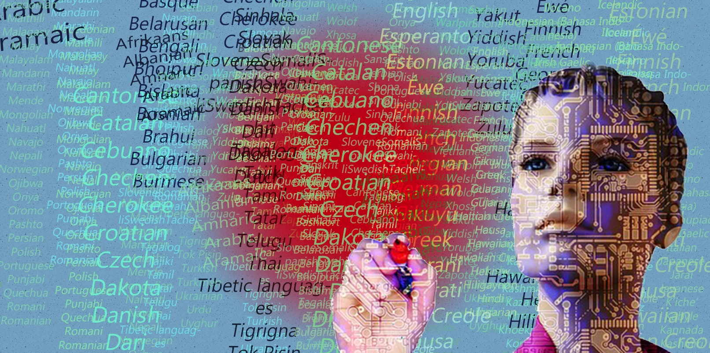

# Future Plans

With our product "Translator", we've been able to create a system that assists people with different instances of translation usage. Our product provides a diverse set of functionality to help people; however, there is still room to grow.&#x20;

## Future Design Potential

In the future we plan to expand upon our language library. As we continue to grow, we plan on further implementing older languages that very miniscle communities use. We also plan on incorporating more efficient translation times with the incorporation of an A.I bot. Not only will this A.I bot help with translation speeds, but it also provide as a embeded digital assistant to help the user go about their day-for example if a user is traveling to a new country, this A.I bot could not only assist with translations but also help them get around in that country with direction services as well as activity recommendations.

<figure><figcaption></figcaption></figure>

## Taking Inspiration

Future designers like us here at "Translator" should take inspiration from their competitors. If you have a problem that you created a solution for, but other solutions already exist for this problem, ask yourself "how can I deviate myself from my competitors and make myself stand out?" Creating a product that has unique features and design will drive users to use your product in comparison to others. For example, it can be said our product "Translator" has some resemblance to Google Translate; however, what makes us unique is that we are an all in one product. We offer multiple services under the same product, and we also expand upon other apps via extensions through zoom and Skype. In design, standing out is key. Find something that makes you stand out but also serves great purpose to your focus group.
