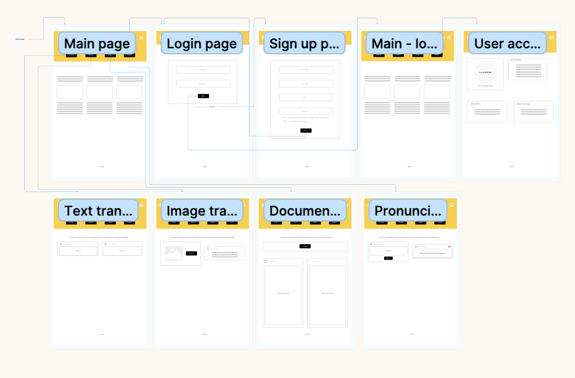

# Prototyping

Figma Prototype:

// a well-presented content that shows the process with which you iterated from wireframe(s) to prototypes. Explain the iterations you made, justifying why you made those iterations. Present usability test appropriately to show potential and limitations of your design

[https://www.figma.com/file/0tIqjYH3OEuJCnxyYOpW6S/Team-6-Prototype?type=design\&node-id=0-1\&t=NEaUHMEIvkibR7He-0](https://www.figma.com/file/0tIqjYH3OEuJCnxyYOpW6S/Team-6-Prototype?type=design\&node-id=0-1\&t=NEaUHMEIvkibR7He-0)



### UI Changes:

##

##  -> &#x20;

